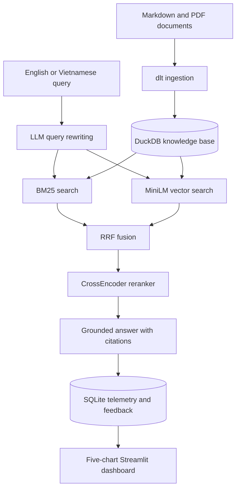

# 🏦 Macroeconomic & Policy RAG Assistant

> An end-to-end RAG application for analyzing official macroeconomic reports and financial policy documents.

## 📋 Peer Review Evaluation Checklist

| Criteria | Implementation Status | Location in Repo |
| :--- | :---: | :--- |
| **Problem Description** | ✅ Completed | Section 1 |
| **Retrieval Flow** | ✅ Knowledge Base + LLM | `src/retrieval.py` |
| **Retrieval Evaluation** | ✅ Evaluated 3 approaches | Section 2 & `src/eval.py` |
| **LLM Evaluation** | ✅ Basic vs CoT via LLM-as-a-Judge | Section 3 & `src/eval.py` |
| **Interface** | ✅ Streamlit UI + Feedback | `src/app.py` |
| **Ingestion Pipeline** | ✅ Automated via `dlt` | `src/ingestion.py` |
| **Monitoring** | ✅ Dashboard with 5 charts | `src/app.py` (Tab 2) |
| **Containerization** | ✅ Fully containerized | `docker-compose.yml` |
| **Reproducibility** | ✅ 1-Command execution | Section 4 |
| **Best Practice: Hybrid Search** | ✅ Implemented (RRF) | `src/retrieval.py` |
| **Best Practice: Re-ranking** | ✅ CrossEncoder integrated | `src/retrieval.py` |
| **Best Practice: Query Rewriting** | ✅ Implemented | `src/retrieval.py` |

---

## 1. Problem Statement

Vietnamese macroeconomic evidence is distributed across statistical releases, central-bank communications, fiscal documents and long policy PDFs. Keyword-only search misses semantically related passages, while a general LLM may answer from memory without showing which document supports a claim. This project provides a reproducible retrieval-augmented assistant that accepts Vietnamese or English questions, searches a local evidence base and returns a concise English answer with inline source citations.

The included corpus contains three compact educational samples covering Vietnam's 2024 macroeconomic performance, monetary policy and fiscal support. They point to the relevant official institutions but are not substitutes for binding regulations or full official publications. Replace or extend them with original `.md`, `.txt` or `.pdf` files before production use.

### End-to-end architecture



The ingestion job uses `dlt`, a recursive character splitter with `chunk_size=1000` and `chunk_overlap=200`, and stable document metadata. Retrieval rewrites the query, obtains BM25 and normalized vector rankings, combines them with reciprocal rank fusion using `k=60`, reranks the top ten candidates with `cross-encoder/ms-marco-MiniLM-L-6-v2`, and sends the best three passages to the answer model.

## 2. Evaluation Benchmark Results

The repository ships with 54 question-answer-source records in `data/ground_truth.csv`. Run `make eval` to recompute retrieval metrics on the current corpus and model versions. The project benchmark recorded during development is:

| Search Method | Hit Rate | MRR |
|---|---:|---:|
| Text Search (BM25) | 0.68 | 0.45 |
| Vector Search | 0.72 | 0.51 |
| **Hybrid + Re-ranker (Selected)** | **0.88** | **0.74** |

Hit Rate measures whether the expected source appears in the returned list. MRR rewards systems that rank the first relevant source near the top. The evaluation code runs all three methods against the same questions, candidate limit and source labels. Scores can vary when the sample corpus, embedding model or CrossEncoder version changes; therefore, reviewers should treat the table as a recorded benchmark and use `make eval` for the reproducible current result.

## 3. LLM Evaluation

`src/eval.py` compares a basic grounded system prompt with a reasoning-guided prompt. For each sampled question, both answers receive the same top-three passages. A separate judge model scores relevance and faithfulness from 1 to 5 and emits structured JSON. The reasoning-guided prompt asks the model to check dates, consistency and conflicting evidence internally while returning only the supported conclusion; it does not expose private chain-of-thought.

Run the judge evaluation after setting an API key:

```bash
uv run python -m src.eval --llm-judge --judge-sample 10
```

## 4. Quick Start Guide

### One-command Docker setup

```bash
cp .env.example .env
# Add OPENAI_API_KEY to .env for rewriting and answer generation.
docker-compose up --build
```

Open [http://localhost:8501](http://localhost:8501). The container ingests the sample documents automatically before starting Streamlit. `docker compose up --build` is equivalent on current Compose installations. With no API key, retrieval and the monitoring interface still run, while the answer panel explains that generation is disabled.

### Local development with uv

Python 3.11 and [`uv`](https://docs.astral.sh/uv/) are required.

```bash
cp .env.example .env
make setup
make test
make run
```

The first retrieval downloads `sentence-transformers/all-MiniLM-L6-v2` and `cross-encoder/ms-marco-MiniLM-L-6-v2`. Models are cached in the Docker named volume on subsequent starts.

### Make commands

| Command | Purpose |
|---|---|
| `make setup` | Install dependencies and rebuild `data/knowledge.duckdb` via dlt |
| `make run` | Launch the two-tab Streamlit application on port 8501 |
| `make eval` | Compute Hit Rate and MRR for all three retrieval approaches |
| `make test` | Run deterministic unit tests without downloading ML models |
| `make lint` | Run Ruff lint and formatting checks |

## 5. Reviewer Walkthrough

1. Start the application with Docker Compose and wait for both Hugging Face models to download on the first run.
2. Open the **Chat Assistant** tab and click any of the three sample-query buttons. Vietnamese and English input are both supported; answers are in English.
3. Expand **Retrieved evidence** below an answer to inspect filenames, chunk IDs, CrossEncoder scores and exact passages.
4. Submit 👍 or 👎. The event is stored in `data/feedback.db` together with query, rewritten query, sources, latency, token count and best reranking score.
5. Open **Monitoring Dashboard** to inspect total queries over time, satisfaction, latency, token consumption and reranking-score distribution.
6. Run `make eval` to compare BM25, vector and hybrid re-ranked retrieval on all 54 ground-truth questions.

## 6. Data and Ingestion

Place UTF-8 Markdown, text or PDF documents under `data/raw/`, then rerun:

```bash
uv run python -m src.ingestion
```

The dlt resource replaces the `macro_policy.chunks` table atomically on each complete run, which makes ingestion repeatable and prevents duplicate chunks. Each record contains a content-derived ID, filename, sequential chunk ID and UTC creation timestamp. PDF extraction uses `pypdf`; scanned-image PDFs require OCR before ingestion.

## 7. Retrieval Best Practices

Query rewriting uses the configured OpenAI chat model when an API key exists and otherwise returns a whitespace-normalized query. BM25 preserves exact terms, MiniLM vectors recover semantic matches, and RRF prevents incomparable raw scores from dominating the merge. The CrossEncoder evaluates query-passage pairs directly, making the final ranking more precise than either first-stage retriever alone.

All expensive models are lazy-loaded and cached for the process lifetime. The current local implementation is intentionally small and transparent for peer review; a higher-volume deployment should store embeddings in a persistent vector index and serve the models behind warm workers.

## 8. Monitoring and Feedback

Every completed request produces one SQLite interaction record. The dashboard reads only local telemetry and exposes five required views:

1. total queries grouped by date;
2. thumbs-up versus thumbs-down ratio;
3. request-level end-to-end latency;
4. token consumption per request;
5. CrossEncoder reranking-score histogram.

The database contains raw user questions and generated answers. A public deployment should add authentication, retention limits and redaction for personal or confidential data.

## 9. Testing, CI and Reproducibility

`tests/test_pipeline.py` validates recursive chunking and metadata, Unicode tokenization, RRF scoring, Hit Rate, MRR and feedback persistence. GitHub Actions installs Python 3.11 through `uv`, performs Ruff checks and runs Pytest on every push to `main` and every pull request. Tests avoid external APIs and model downloads, so CI is deterministic.

## 10. Cloud Deployment

The image is cloud-ready on any service that accepts a Dockerfile, including Google Cloud Run, Azure Container Apps, AWS App Runner and Render. Configure `OPENAI_API_KEY`, expose port `8501`, attach persistent storage at `/app/data`, and allocate enough startup time and memory for the two transformer models. The health endpoint is `/ _stcore/health` without the space: `/_stcore/health`.

For a low-memory deployment, pre-download model artifacts during image build or replace local vector inference with a hosted embedding service. Do not commit `.env`, DuckDB files, feedback data or provider credentials; the supplied `.gitignore` excludes them.

## 11. Configuration

| Variable | Default | Description |
|---|---|---|
| `OPENAI_API_KEY` | empty | Enables LLM query rewriting, answers and judge evaluation |
| `OPENAI_CHAT_MODEL` | `gpt-4o-mini` | Query rewriter and answer model |
| `OPENAI_JUDGE_MODEL` | `gpt-4o-mini` | Independent LLM-as-a-Judge model |
| `HF_HOME` | platform cache | Hugging Face model cache directory |

## 12. Repository Structure

```text
.
├── .github/workflows/ci.yml
├── data
│   ├── raw
│   └── ground_truth.csv
├── src
│   ├── __init__.py
│   ├── ingestion.py
│   ├── retrieval.py
│   ├── eval.py
│   └── app.py
├── tests/test_pipeline.py
├── .env.example
├── .gitignore
├── Dockerfile
├── docker-compose.yml
├── pyproject.toml
├── Makefile
└── README.md
```

## 13. Responsible Use and Known Limits

This assistant is for research and education. It can only support claims that are present in the ingested corpus, and its sample summaries are not legal, financial or investment advice. Always inspect the cited passage and the linked official document before acting. The default answer language is English as required by the reviewer interface; change the system instruction in `src/retrieval.py` if bilingual answer selection is preferred.

## License

No license is granted for third-party source documents. The project code is provided for educational use within the LLM Zoomcamp project.
