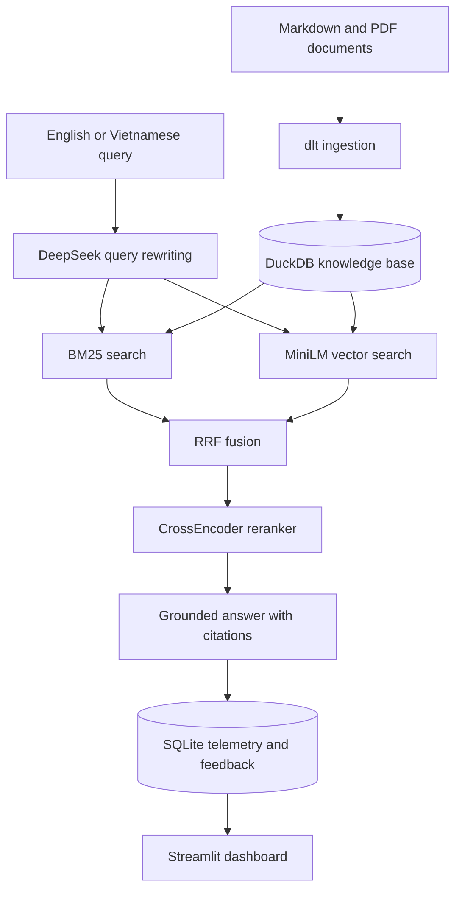

# 🏦 Macroeconomic & Policy RAG Assistant

An end-to-end retrieval-augmented generation (RAG) application for exploring Vietnamese macroeconomic reports and financial-policy documents. Ask a question in Vietnamese or English, inspect the retrieved evidence, and receive a concise English answer with source citations.

## Problem and approach

Macroeconomic evidence is distributed across statistical releases, central-bank communications, fiscal documents, and long policy publications. Keyword-only search can miss related passages, while a general LLM may answer from memory without showing supporting material. This application searches a local evidence base before generating an answer, so users can inspect the exact source passages behind a response.

The included corpus contains three compact educational samples about Vietnam's 2024 macroeconomic performance, monetary policy, and fiscal support. They point to relevant institutions but are not substitutes for binding regulations or full official publications. Add original `.md`, `.txt`, or `.pdf` files before using the app with a broader corpus.



The ingestion job uses `dlt`, a recursive character splitter (`chunk_size=1000`, `chunk_overlap=200`), and stable document metadata. Retrieval rewrites the query, combines BM25 and normalized vector rankings with reciprocal rank fusion (RRF, `k=60`), reranks the top ten candidates with `cross-encoder/ms-marco-MiniLM-L-6-v2`, and provides the best three passages to the answer model.

## Quick start

### Docker Compose

```bash
cp .env.example .env
docker compose up --build
```

Docker Engine with the Compose plugin is required. Open [http://localhost:8501](http://localhost:8501), select **Fast — BM25**, and ask a sample question. This fastest path needs no API key or model download: it returns cited extracts from the local sample documents. The container ingests the sample documents before starting Streamlit.

`DEEPSEEK_API_KEY` is optional. Add your own key to `.env` to enable DeepSeek query rewriting and generated answers. If port 8501 is already in use, run `HOST_PORT=8502 docker compose up --build` and open [http://localhost:8502](http://localhost:8502). The application still uses port 8501 inside the container.

### Local development

Python 3.11 and [`uv`](https://docs.astral.sh/uv/) are required.

```bash
cp .env.example .env
make setup
make test
make run
```

Fast — BM25 is the default retrieval mode and works immediately without model downloads. Advanced — Hybrid + reranker combines BM25, MiniLM vector search, RRF, and a CrossEncoder. Its first use downloads `sentence-transformers/all-MiniLM-L6-v2` and `cross-encoder/ms-marco-MiniLM-L-6-v2`, which can take several minutes. Docker stores these models in a named volume so later starts can reuse them.

| Command | Purpose |
|---|---|
| `make setup` | Install dependencies and rebuild `data/knowledge.duckdb` via dlt. |
| `make run` | Launch the Streamlit application on port 8501. |
| `make eval` | Compute Hit Rate and MRR for the retrieval methods. |
| `make test` | Run deterministic unit tests without ML-model downloads. |
| `make lint` | Run Ruff lint and formatting checks. |

## Using the application

1. Start the application and open the **Chat Assistant** tab.
2. Enter a Vietnamese or English question, or select a sample query.
3. Use **Fast — BM25** for immediate local keyword retrieval, or **Advanced — Hybrid + reranker** for semantic retrieval after its first-run model download.
4. Read the answer and expand **Retrieved evidence** to view filenames, chunk IDs, correctly labelled retrieval scores, and source passages. Without a DeepSeek key, the answer is a cited extractive fallback.
5. Optionally submit 👍 or 👎 feedback.
6. Open **Monitoring Dashboard** to view query volume, satisfaction, latency, token use, and retrieval-score distribution.

## Data ingestion

Place UTF-8 Markdown, text, or PDF documents under `data/raw/`, then run:

```bash
uv run python -m src.ingestion
```

The dlt resource replaces the `macro_policy.chunks` table after a complete run, making ingestion repeatable and preventing duplicate chunks. Each record has a content-derived ID, filename, sequential chunk ID, and UTC creation timestamp. PDF extraction uses `pypdf`; scanned PDFs require OCR before ingestion.

## Retrieval and evaluation

BM25 preserves exact terms, MiniLM vectors recover semantic matches, and RRF combines the two ranked lists without comparing their raw scores. The CrossEncoder directly scores query-passage pairs to improve the final ordering. Query rewriting uses the configured DeepSeek chat model when an API key is available; otherwise it uses the original normalized query.

`data/ground_truth.csv` contains 54 question-answer-source records. Run `make eval` to compare BM25, vector search, and hybrid retrieval on this dataset. Hit Rate measures whether the expected source appears in the result list; MRR rewards ranking the first relevant source higher.

To compare basic and reasoning-guided prompts with an LLM judge, set `DEEPSEEK_API_KEY` and run:

```bash
uv run python -m src.eval --llm-judge --judge-sample 10
```

The reasoning-guided prompt checks dates, consistency, and conflicting evidence internally, then returns only a concise supported conclusion.

## Monitoring and feedback

Each completed request is saved to SQLite with its query, rewritten query, sources, latency, token count, and best reranking score. The dashboard visualizes:

1. total queries over time;
2. thumbs-up and thumbs-down feedback;
3. end-to-end latency;
4. token consumption; and
5. reranking-score distribution.

The database contains user questions and generated answers. A public deployment should add authentication, retention limits, and redaction for personal or confidential data.

## Configuration

| Variable | Default | Description |
|---|---|---|
| `DEEPSEEK_API_KEY` | empty | Optional. Enables DeepSeek query rewriting, generated answers, and judge evaluation; blank uses cited extracts. |
| `DEEPSEEK_BASE_URL` | `https://api.deepseek.com` | DeepSeek's OpenAI-compatible API base URL. |
| `DEEPSEEK_CHAT_MODEL` | `deepseek-chat` | Query rewriter and answer model. |
| `DEEPSEEK_JUDGE_MODEL` | `deepseek-chat` | Model used for LLM-as-a-judge evaluation. |
| `HF_HOME` | platform cache | Hugging Face model cache directory. |

Never commit `.env`, DuckDB files, feedback data, or provider credentials. The supplied `.gitignore` excludes local credentials and generated data.

## Deployment notes

The Docker image can run on a container platform such as Google Cloud Run, Azure Container Apps, AWS App Runner, or Render. Configure the DeepSeek environment variables, expose port `8501`, attach persistent storage at `/app/data`, and allow sufficient startup time and memory for the two transformer models. The health endpoint is `/_stcore/health`.

For low-memory deployments, pre-download model artifacts during image build or use a hosted embedding service instead of local vector inference.

## Repository structure

```text
.
├── data
│   ├── raw
│   └── ground_truth.csv
├── src
│   ├── ingestion.py
│   ├── retrieval.py
│   ├── eval.py
│   └── app.py
├── tests/test_pipeline.py
├── .env.example
├── Dockerfile
├── docker-compose.yml
├── pyproject.toml
└── Makefile
```

## Responsible use

This assistant is for research and education. It supports claims only when they are present in the ingested corpus, and its sample summaries are not legal, financial, or investment advice. Inspect cited passages and their original official documents before acting.
